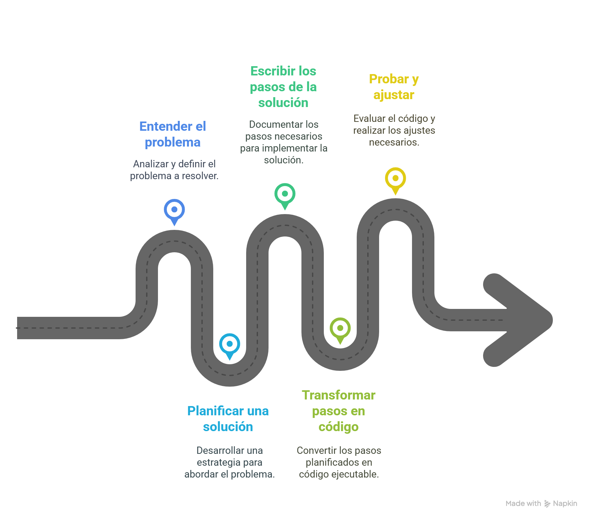

# Lógica de Programación: Introducción con JavaScript

## 🧠 ¿Lógica de programación?
La capacidad de organizar y estructurar ideas para resolver problemas a través del codigo.

## 🧠 ¿Qué es un algoritmo?
Un **algoritmo** es una secuencia logica de pasos para alcanzar un objetivo.



### ¿Pero pra qué sirve esto?
La *lógica* es la **base del razonamiento computacional**.Te enseña a pensar de manera clara, objetiva y estructurada, lo que te ayudará no solo a programar, sino tambien a resolver problemas.

Quienes trabajan en tecnologia necesitan **comprender el problema, planear la solución y dividirla en etapas que puedan ser ejecutadas**

El poder de la lógica: **enseñarte a resolver problemas por etapas y con claridad.**

--------------------------------------------------------------
## ¿Qué es exactamente un lenguaje de programación?

Las computadoras no entienden de idiomas humanos, operan a un nivel mucho mas básico, manejan impulsos eléctricos que se representan mediante **códigos binarios**, compuestos por [0]s y [1]s.
Poder comunicarnos con estas maquinas, usamos un intermediario: el **lenguaje de programación**.

## Se utilizara el lenguaje **JavaScript** para aprender la lógica de programación por algunas razonres:

- Es un lenguaje popular
- Funciona directamente en el navegador
- Permite ver el resultado del codigo casi en tiempo real
- Es una puerta de entrada para desarrollo web y aprender lógica.

--------------------------------------------------------------
## Variables y Condicionales

Las **variables** son un espacio en memoria donde almacenar informacion.

Se declaran con:
- `let`
- `const`
- `var`(no recomendado)

> ⚠️ Importante: JavaScript es **case-sensitive**.

```javascript
const name = "Luciano";
let edad = 31;
```

La forma mas utilizada para declarar variables en js es usando **camelCase**, ej:
```javascript
let nombreUsuario = "Luciano";
```
### Operadores usados con variables
- =: asignación
- ==: comparación(valor)
- ===: comparación(valor y tipo de dato)
--------------------------------------------------------------
## Condicionales y Concatenación

Los comentarios en el codigo se realizan de dos maneras:
- //: comentario de una sola linea
- /* */: comentario de linea multiple

### Condicional **if-else**:
```javascript
if (condicion) {
    //cumple la condición
} else {
    //no la cumple
}
```

### **Template Strings**
Son cadenas literales que habilitan el uso de expresiones incrustadas, que permiten usar cadenas de caracteres de mas de una línea y funcionalidades de interpolacion de cadena de caracteres.

 ej: `texto de cadena de caracteres ${expresión} texto adicional`

### extensions --> LiveServer
Permite visualizar cambios en tiempo real en el navegador mientras se desarrolla una aplicacion web.

### Punto y coma en JS
El uso del punto y coma (;) es una practica recomendada. el lenguaje tiene un mecanismo llamado **"Insersión automática de punto y coma"** (authomatic semicolon insertion - ASI) que intenta agregar (;) en cietos puntos del codigo donde se necesita.
--------------------------------------------------------------
## Loops y Tentativas

### Los **operadores logicos** son:
- AND(&&)
- OR(||)
- Negacion(!)

De comparacion:
- ==(igual)
- !=(distinto)
- <(menor que)
- >(mayor que)
- <=(menor igual)
- >=(mayor igual) 

### Operador ternario:
condicion ? expresionSiVerdadera : expresionSiFalsa;

### Funciones Math.random() - Math.floor()
Generan numeros **pseudo-randomico** y podemos obtener el numero en formato entero

Obtener el tipo de dato, convertir el dato:
```javascript
typeof(variable);

parseInt(variable);
```
