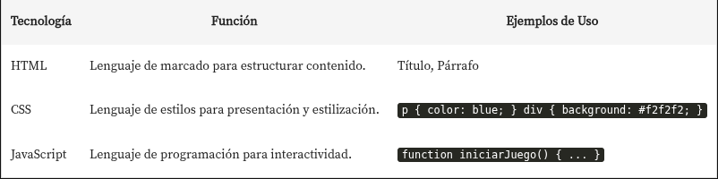
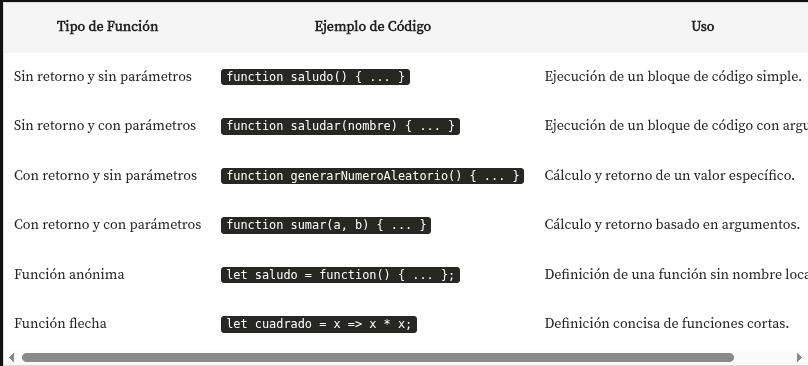

# Lógica de Programación: Explorar Funciones y Listas

## DOM
**D**ocument **O**bject **M**odel: es una interfaz de programacion para los documentos html y xml. facilita la representacion estructurada del documento y define de que manera los programas pueden acceder, a su contenido.

### Selectores
Es la forma en la que JS selecciona el contenido del html

## Diferencias entre HTML, CSS y JS

## Hoisting
Es un comportamiento donde las declaraciones de las variables y funciones son movidas logicamente al principio de su ámbito(scope) durante la fase de compilación, antes que se ejecute el codigo.

## Diferencias entre funciones

- modificar un atributo de un objeto del html como 
- **removeAttribute** ej: boton --> document.getElementById('id').removeAttribute('id_boton');
- **setAttribute** ej: document.querySelector('#id').setAttribute('disabled', 'true');

## Listas
- let numeros = [1, 4, 5];
- numeros.push(6); *añado un nuevo elemento*
- numeros.length *obtengo el tamaño de la lista*
- numeros[numeros.length-1] *obtengo el ultimo elemento de la lista*

!**Recursividad**
Me permite realizar un llamado a la misma funcion que estoy declarando, haciendo que se llame a si misma.